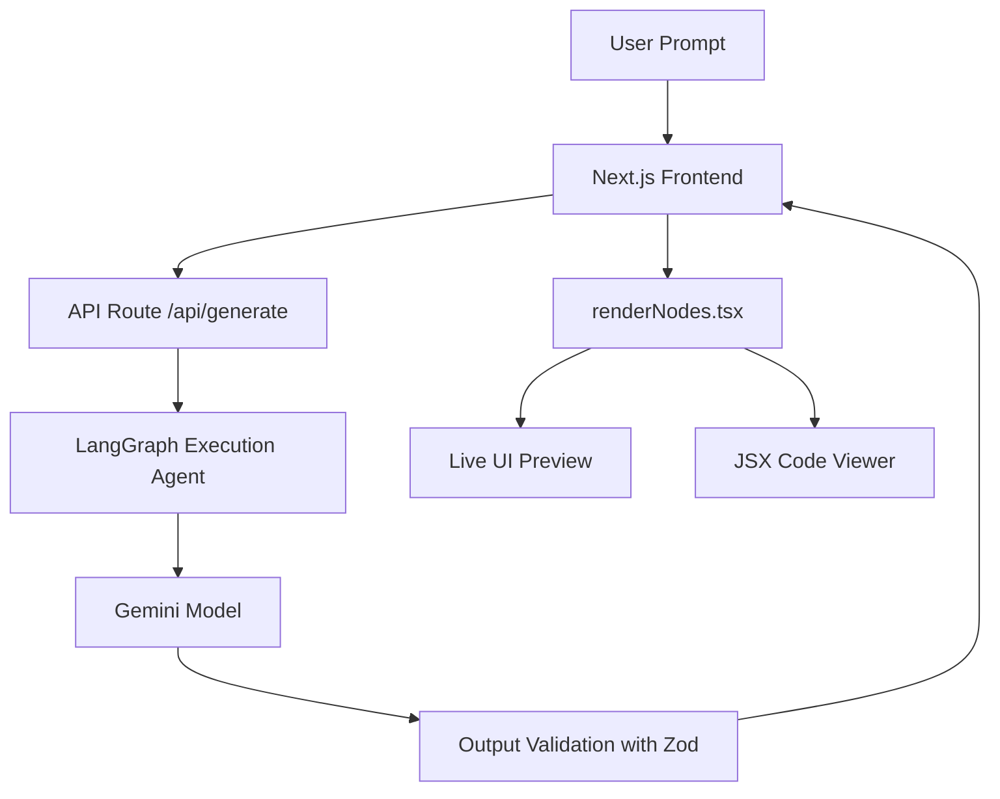

# Web Builder SG

An AI-powered website builder that generates functional prototypes using **Singapore's LifeSG React Design System**. This project uses an agentic backend to translate natural language prompts into structured UI layouts.

## 🏗️ Architecture & Workflow



## 📦 Supported LifeSG Components

The generation engine utilizes a verified set of components from the LifeSG Design System to ensure accessibility and visual consistency:

| Component | Category | Description |
| :--- | :--- | :--- |
| Button | Action | Standard triggers for primary, secondary, and link-style actions. |
| SingpassButton | Action | Official Singpass login button for government digital services. |
| Card | Layout | Styled container for grouping related content blocks with titles. |
| Grid / Column | Layout | Native structural foundations for responsive, flexible layouts. |
| Input / Textarea | Form | Text entry controls supporting labels, placeholders, and multi-line input. |
| DateInput / Select | Form | Specialized inputs for date picking and dropdown selections. |
| Checkbox / RadioButton| Form | Selection controls for binary choices or mutually exclusive options. |
| Toggle | Form | Switches for enabling/disabling binary application settings. |
| Accordion | Content | Collapsible headers for managing content density in complex forms. |
| Alert | Feedback | Contextual banners for Success, Warning, Error, and Info notifications. |
| NavBar | Navigation | Standardized top-level orienting container for apps and branding. |
| Pagination | Navigation | Structural controls for navigating through paginated datasets. |
| Heading | Content | Hierarchical typography (H1-H4) for section structural integrity. |

## 🚀 Setup & Deployment

Create a `.env` file using the `.env.example` template. Enter your Gemini API key and preferred Gemini model.

This application is optimized for deployment on a single machine using Docker. Lifecycle management is simplified via the provided Makefile.

Production Deployment Commands:

```bash
make build # Build the production-optimized standalone Docker image
make up    # Build and start the application service (accessible at port 3000)
make logs  # Monitor real-time output from the container
make down  # Stop and remove the application container
```