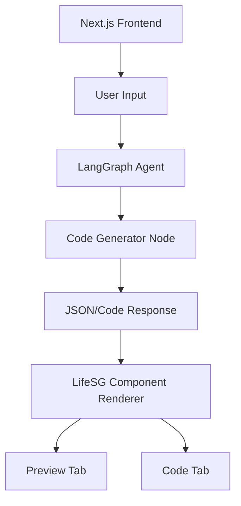

# Web Builder SG - AI Engineer Assignment

This is a functional prototype of an AI-powered website builder that generates layouts using the **LifeSG React Design System**.

## 🚀 Features
- **AI Generation**: Uses LangGraph to orchestrate component selection and layout generation.
- **LifeSG Integration**: Strictly uses LifeSG components for UI consistency.
- **Live Preview**: Toggle between a rendered view and the generated React code.
- **Responsive Design**: Fully compatible with mobile and desktop views.

## 🛠️ Technology Stack
- **Frontend**: React (Next.js), Styled Components
- **Design System**: [@lifesg/react-design-system](https://github.com/LifeSG/react-design-system)
- **LLM Orchestration**: LangChain & LangGraph (using Gemini API)
- **Backend**: Node.js

## 🏗️ Basic Workflow Architecture

## 📦 LifeSG Components Used
| Component | Usage |
| :--- | :--- |
| `Button` | Primary actions and generation triggers. |
| `Input` | User prompt input area. |
| `Layout.Content` | Main container for generated content. |
| `Card` | Used for displaying section blocks in the generated UI. |
| `Tabs` | Navigation between 'Preview' and 'Code' views. |
| `Typography` | Render `Body` and `Heading` element components. |

## 🏃 How to test locally
1. **Clone the repo**: `git clone git@github.com:calvinli08/life-sg-web-builder.git`
2. **Install dependencies**: `npm install`
3. **Set Environment Variables**: Create a `.env` file with your `GEMINI_API_KEY` and set your preferred model in `GEMINI_MODEL_NAME`.
4. **Start the development server**: `npm run dev`
5. **Access the app**: Navigate to `http://localhost:3000`

---